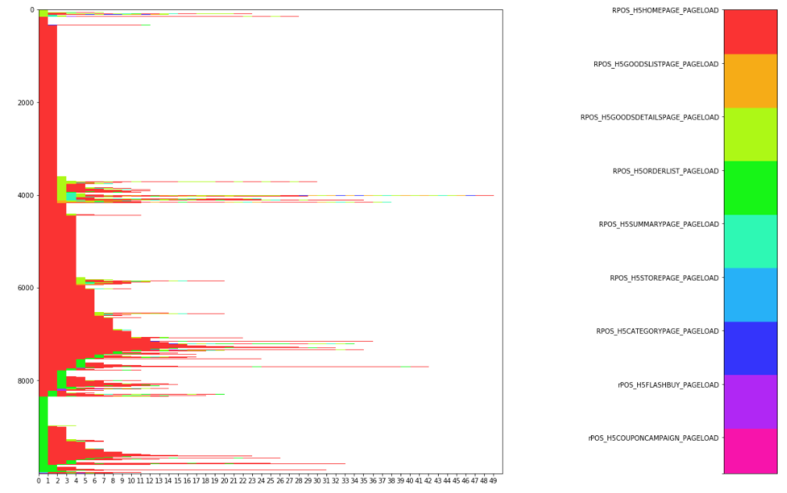

<h1 align="center">Cjourney</h1>

[TOC]

<!-- <font face="Calibri"> -->

### Problem
- 经常见到使用 sankey, funnel 或者其他一些图片来分析 app 中的 customer journey,但是这些方式聚都是合一段时间的数据,粒度太大且是单向的.

### Idea
- 最近看到了一些东西, Airbnb 的一篇关于 Embedding 的的论文以及 Tensorflow 的图像和文本处理 API. 每个客户的行为都可以编成序列, 用颜色编码行为并进行 Padding, 排序后就可以绘制一张customer journey map. 相似行为的客户序列会聚集在一起形成区域性的色块.

### Guide
#### Install
```
pip install --user --upgrade cjourney
```

#### Use
```
from cjourney import Cjourney
import pandas as pd

cc = Cjourney()
df = pd.read_parquet('event_test.parquet')
cc.fit_on_actions(df, 'event')
cc.actions_to_sequences(cusid='personid', event='event', timestamp='cdate')
cc.padding(50, sampsize=10000)
```


#### Next Version
- 目前版本一行为一个客户的行为序列, 一个像素为一个动作. 下一版本中纵坐标可以替换为秒, 若一个动作持续时间较长, 则会占据多个像素位.
<!-- </font> -->